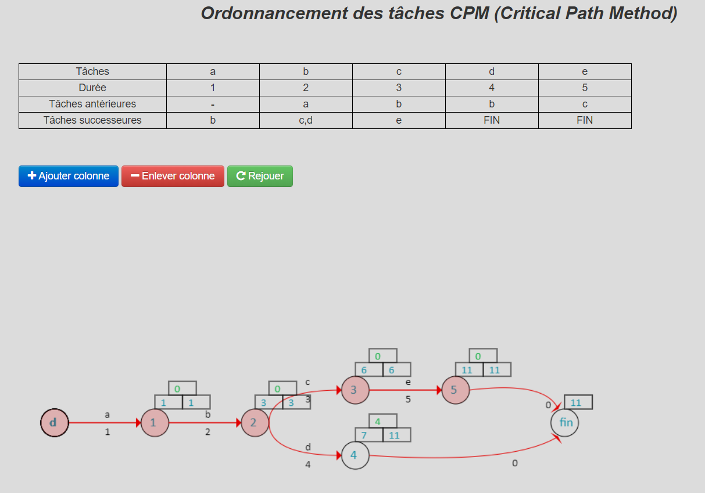

# CPM
Simulation de l’ordonnancement de tâches CPM (Critical Path Method) développé avec Javascript.

Cette simulation permet d'identifier le chemin critique lors de l'ordonnancement des tâches (pour un projet par exemple), la durée totale du projet, les marges de retard pour chaque tâche (en vert), la durée de chaque tâche, la date au plutôt et plutard d'une tâche...

